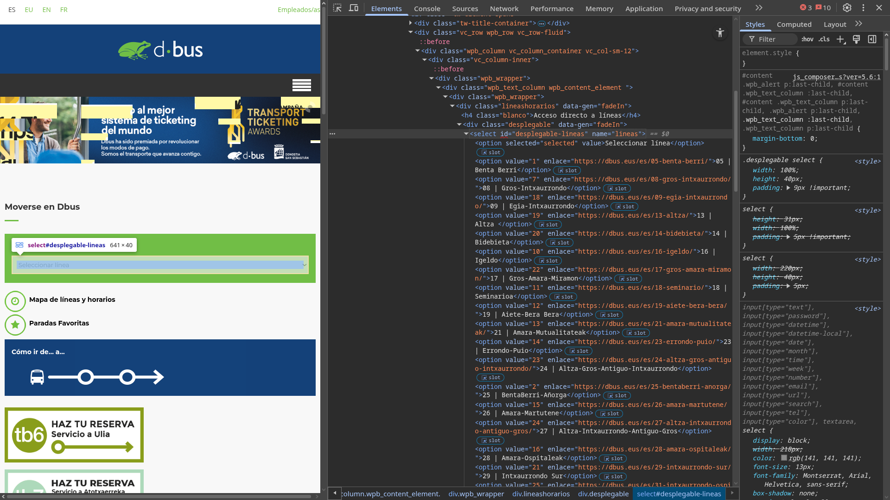

import dbusConsultarTiemposVideo from './assets/dbus-consultar-tiempos.webm';
import dbusBotDiscordVideo from './assets/dbus-bot-discord.webm';
import dbusNotificacionMovilVideo from './assets/notificacion-movil.mp4';

¡Hola de nuevo a todxs! Durante esta semana me he hecho una lista en un Post-it con algunas ideas sobre los temas que me gustaría tratar en próximas entradas del blog. Ahora que ha llegado el sábado, por fin tengo algo de tiempo para sentarme a escribir (técnicamente llevo todo el día sentado, solo que he estado leyendo más que escribiendo 😅).

Hoy me gustaría hablar sobre un proyecto personal que comencé en febrero del año pasado (2025) a raíz de una frustración: los **buses** que tengo que coger para volver a casa desde la universidad **nunca llegan a la hora**. Uno nunca sabe si va a llegar 5 minutos antes o 20 minutos después de lo previsto.

<!-- truncate -->

Pero, ¡no temáis! Porque el ayuntamiento ofrece una **aplicación para el móvil** que da los tiempos de llegada **en tiempo real**. *"Entonces, ¿cuál es el problema?"*, os preguntaréis. Pues en realidad, ninguno. Solo que todos los días al final de la última clase, tengo que sacar el móvil, abrir la app, buscar la parada, y mirar cuánto le queda a mi bus. Dependiendo de lo que ponga, sé si tengo que correr o no. Y yo no sé vosotrxs, pero si estudio ingeniería es para que mi vida sea eficiente. Y no os voy a mentir, me da mucha pereza tener que hacer todo eso.

Así que pensé: *"No sería increíble que me llegara un mensaje al móvil **justo** cuando mi bus esté a 7 minutos de llegar?"*.

## El plan

Como buen ingeniero, lo primero que hice fue **dividir el problema en partes más pequeñas**:

1. **Obtener los datos** de llegada de los buses en tiempo real
2. Crear una **API** que me permita consultar esos datos fácilmente
3. Hacer que me llegue una **notificación al móvil** cuando el bus esté a 7 minutos

Os voy avisando de que esta entrada va a ser un poco larga, porque me gustaría explicar con detalle cómo conseguí hacer cada una de estas partes. Así que sin más dilación, ¡empecemos!

## Primera fase: Obtener los datos

Honestamente, esta parte fue la más divertida de todas. Allá vamos.

El servicio de buses también publica los tiempos de llegada en [su página web](https://dbus.eus/es/). Desde la página principal, seguimos los siguientes pasos:
1. **Elegir la línea desde el desplegable**. Esto nos lleva a la página específica de la línea.
2. En la página de la línea, **elegir la parada desde otro desplegable**. Esto nos lleva a la página de la parada.
3. En la página de la parada, podemos ver los tiempos de llegada de **cualquier línea** que pase por esa parada. (Este es un detalle importante, ya que veremos más líneas además de la que nos interesa).

<video src={dbusConsultarTiemposVideo} autoPlay muted loop controls style={{maxWidth: '100%', height: 'auto'}} />

### Obteniendo las líneas

El desplegable de selección de línea muestra una lista con todas las líneas de bus disponibles. Así que podemos parsear el HTML de la página principal para obtener esa lista.



Sabemos que el desplegable tiene el atributo `id="desplegable-lineas"`, así que podemos buscar ese elemento en el DOM para obtener todas las opciones disponibles.

```html
<select id="desplegable-lineas" name="lineas">
```

*¿Qué es el DOM?* Pues el Document Object Model, una representación estructurada del documento HTML que nos permite interactuar con él mediante JavaScript. No te preocupes, yo tampoco lo sabía en ese momento. De hecho, fue la primera vez que usé JavaScript en serio. Cuando veamos la implementación, nos iremos familiarizando con los términos.

Si nos metemos al código fuente de la página, encontramos la siguiente función:

```javascript showLineNumbers=579 title="view-source:https://dbus.eus/es/"
function get_lineas_front(){
    lineas_front=JSON.parse('[{"texto":"05 | Benta Berri","valor":"1","enlace":"https:\/\/dbus.eus\/05-benta-berri\/"},{"texto":"08 | Gros-Intxaurrondo","valor":"7","enlace":"https:\/\/dbus.eus\/08-gros-intxaurrondo\/"},{"texto":"09 | Egia-Intxaurrondo","valor":"18","enlace":"https:\/\/dbus.eus\/09-egia-intxaurrondo\/"},{"texto":"13 | Altza ","valor":"19","enlace":"https:\/\/dbus.eus\/13-altza\/"},{"texto":"14 | Bidebieta","valor":"20","enlace":"https:\/\/dbus.eus\/14-bidebieta\/"},{"texto":"16 | Igeldo","valor":"10","enlace":"https:\/\/dbus.eus\/16-igeldo\/"},{"texto":"17 | Gros-Amara-Miramon","valor":"22","enlace":"https:\/\/dbus.eus\/17-gros-amara-miramon\/"},{"texto":"18 | Seminarioa","valor":"11","enlace":"https:\/\/dbus.eus\/18-seminarioa\/"},{"texto":"19 | Aiete-Bera Bera","valor":"12","enlace":"https:\/\/dbus.eus\/19-aiete-bera-bera\/"},{"texto":"21 | Amara-Mutualitateak","valor":"13","enlace":"https:\/\/dbus.eus\/21-amara-mutualitateak\/"},{"texto":"23 | Errondo-Puio","valor":"14","enlace":"https:\/\/dbus.eus\/23-errondo-puio\/"},{"texto":"24 | Altza-Gros-Antiguo-Intxaurrondo","valor":"23","enlace":"https:\/\/dbus.eus\/24-altza-gros-antiguo-intxaurrondo\/"},{"texto":"25 | BentaBerri-A\u00f1orga","valor":"2","enlace":"https:\/\/dbus.eus\/25-bentaberri-anorga\/"},{"texto":"26 | Amara-Martutene","valor":"15","enlace":"https:\/\/dbus.eus\/26-amara-martutene\/"},{"texto":"27 | Altza-Intxaurrondo-Antiguo-Gros","valor":"24","enlace":"https:\/\/dbus.eus\/27-altza-intxaurrondo-antiguo-gros\/"},{"texto":"28 | Amara-Ospitaleak","valor":"16","enlace":"https:\/\/dbus.eus\/28-amara-ospitaleak\/"},{"texto":"29 | Intxaurrondo Sur","valor":"21","enlace":"https:\/\/dbus.eus\/29-intxaurrondo-sur\/"},{"texto":"31 | Intxaurrondo-Ospitaleak-Altza","valor":"25","enlace":"https:\/\/dbus.eus\/31-intxaurrondo-ospitaleak-altza\/"},{"texto":"32 | Puio-Errondo","valor":"17","enlace":"https:\/\/dbus.eus\/32-puio-errondo\/"},{"texto":"33 | Larratxo-Intxaur-Berio-Igara","valor":"26","enlace":"https:\/\/dbus.eus\/33-larratxo-intxaurrondo-berio-igara\/"},{"texto":"35 | Antiguo-Aiete-Ospitaleak","valor":"27","enlace":"https:\/\/dbus.eus\/35-antiguo-aiete-ospitaleak\/"},{"texto":"36 | Aldakonea-San Roke","valor":"30","enlace":"https:\/\/dbus.eus\/36-aldakonea-san-roke\/"},{"texto":"37 | Rodil-Zorroaga","valor":"39","enlace":"https:\/\/dbus.eus\/37-rodil-zorroaga\/"},{"texto":"38 | Trintxerpe-Altza-Molinao","valor":"40","enlace":"https:\/\/dbus.eus\/38-trintxerpe-altza-molinao\/"},{"texto":"39 | Urgull","valor":"41","enlace":"https:\/\/dbus.eus\/39-urgull\/"},{"texto":"40 | Gros-Antiguo-Igara","valor":"28","enlace":"https:\/\/dbus.eus\/40-gros-antiguo-igara\/"},{"texto":"41 | Gros-Egia-Martutene","valor":"29","enlace":"https:\/\/dbus.eus\/41-gros-egia-martutene\/"},{"texto":"42 | Aldapa-Egia","valor":"54","enlace":"https:\/\/dbus.eus\/42-aldapa-egia\/"},{"texto":"43 |\u00a0Anoeta-Igara","valor":"43","enlace":"https:\/\/dbus.eus\/43-anoeta-igara\/"},{"texto":"45 | Estaciones Renfe-Bus Geltokiak-Antiguo-Aiete","valor":"56","enlace":"https:\/\/dbus.eus\/45-estaciones-renfe-bus-geltokiak-antiguo-aiete\/"},{"texto":"46 | San Antonio - Morlans","valor":"59","enlace":"https:\/\/dbus.eus\/46-san-antonio-morlans\/"},{"texto":"B1 | Benta Berri-Berio-A\u00f1orga","valor":"31","enlace":"https:\/\/dbus.eus\/b1-benta-berri-berio-anorga\/"},{"texto":"B2 | Aiete-Bera Bera","valor":"32","enlace":"https:\/\/dbus.eus\/b2-aiete-bera-bera\/"},{"texto":"B3 | Egia-Intxaurrondo","valor":"33","enlace":"https:\/\/dbus.eus\/b3-egia-intxaurrondo\/"},{"texto":"B4 | Amara-Riberas-Martutene","valor":"34","enlace":"https:\/\/dbus.eus\/b4-amara-riberas-martutene\/"},{"texto":"B6 | Altza","valor":"35","enlace":"https:\/\/dbus.eus\/b6-altza\/"},{"texto":"B7 | Igeldo","valor":"36","enlace":"https:\/\/dbus.eus\/b7-igeldo\/"},{"texto":"B8 | Miraconcha-BentaBerri-Seminario","valor":"37","enlace":"https:\/\/dbus.eus\/b8-miraconcha-bentaberri-seminario\/"},{"texto":"B9 | Amara-Errondo-Puio","valor":"38","enlace":"https:\/\/dbus.eus\/b9-amara-errondo-puio\/"},{"texto":"B10 | Zubiaurre-Bidebieta-Buenavista","valor":"42","enlace":"https:\/\/dbus.eus\/b10-zubiaurre-bidebieta-buenavista\/"},{"texto":"Gautxorien aurreko zerbitzuak","valor":"52","enlace":"https:\/\/dbus.eus\/pre-buhos-2\/"},{"texto":"TB6 |\u00a0Ulia Taxibusa","valor":"47","enlace":"https:\/\/dbus.eus\/tb6-taxibus-ulia\/"},{"texto":"TB7 | Atotxaerreka - Itsasargi Pasealeku Taxibusa","valor":"62","enlace":"https:\/\/dbus.eus\/tb7-taxibus-atotxaerreka-paseo-del-faro-2\/"},{"texto":"Zerbitzu berezia Anoetara (Futbola)","valor":"48","enlace":"https:\/\/www.dbus.eus\/descargas\/futbol-basket\/servicios-especiales-anoeta-futbol_eu.pdf"},{"texto":"Illunbe \u2013 erdialdea anezka zerbitzua","valor":"65","enlace":"https:\/\/dbus.eus\/illunbe-erdialdea-anezka-zerbitzua\/"},{"texto":"Linea aldaketen taula","valor":"51","enlace":"https:\/\/www.dbus.eus\/descargas\/transbordos.pdf "}]');

    var $desplegable_lineas=jQuery("#desplegable-lineas");
    jQuery.each(lineas_front, function(k,v) {
        jQuery("<option />", {value: v.valor, text: v.texto,enlace:v.enlace}).appendTo($desplegable_lineas);
    });
}
```

Aquí vemos que la función `get_lineas_front` crea un array de objetos JSON llamado `lineas_front`, donde cada objeto representa una línea de bus con su texto, valor y enlace. Luego, utiliza jQuery para seleccionar el elemento del DOM con el id `desplegable-lineas` y añade cada línea como una opción en el desplegable.

Jamás he visto semejante forma de definir datos en mi vida. Pero bueno, funciona. Como nosotros somos un poco más elegantes, vamos a encontrar esa línea usando regex y a extraer el array JSON directamente.

```javascript showLineNumbers
async function getBusLines() {
    const response = await fetch('https://dbus.eus/es/');

    if (!response.ok) {
        throw new Error(`HTTP ${response.status}: ${response.statusText}`);
    }

    const html = await response.text();

    // Extraer el array JSON de la función get_lineas_front
    const match = html.match(/lineas_front=JSON\.parse\('(.+?)'\);/);
    if (!match) {
        throw new Error('Could not find lineas_front data in HTML');
    }

    // Reemplazar caracteres escapados y parsear el JSON
    const jsonString = match[1].replace(/\\\//g, '/').replace(/\\"/g, '"');
    const linesData = JSON.parse(jsonString);

    const options = linesData
        .filter(item => item.texto && item.texto.includes('|'))
        .map(item => {
            // Manejar tanto espacios regulares como espacios no separables
            // después de la barra vertical
            const [code, name] = item.texto.split(/\s*\|\s*/);
            return {
                code: code ? code.trim() : '',
                name: name ? name.trim() : '',
                url: item.enlace,
                internal_id: item.valor
            };
        });

    return options;
}
```

¿Qué hace exactamente este código? Vamos paso a paso:

1. **Obtener el HTML**: Primero hacemos una petición HTTP a la página principal de dbus.eus usando `fetch()`. Si la respuesta no es exitosa (código HTTP distinto de 2xx), lanzamos un error.

2. **Buscar el patrón con Regex**: Aquí viene la parte interesante. Usamos una expresión regular para buscar en todo el HTML la línea donde se define `lineas_front=JSON.parse('...')`. El patrón `/lineas_front=JSON\.parse\('(.+?)'\);/` captura todo lo que está entre las comillas simples. El `(.+?)` es un grupo de captura que obtiene el contenido del string JSON.

3. **Limpiar los caracteres escapados**: Como el JSON viene escapado dentro de un string de JavaScript (con `\/` en lugar de `/` y `\"` en lugar de `"`), necesitamos reemplazar estos caracteres para obtener JSON válido:
   - `replace(/\\\//g, '/')` convierte `\/` en `/`
   - `replace(/\\"/g, '"')` convierte `\"` en `"`

4. **Procesar los datos**: Una vez tenemos el JSON parseado, lo transformamos para que sea más fácil de usar:
   - `.filter()` filtra solo las líneas que tienen el formato "código | nombre" (descartando servicios especiales)
   - `.split(/\s*\|\s*/)` separa el código del nombre usando la barra vertical como delimitador, ignorando espacios
   - `.map()` transforma cada elemento en un objeto más limpio con propiedades descriptivas

El resultado es un array limpio y estructurado con todas las líneas de bus:

```json
[
  {
    "code": "05",
    "name": "Benta Berri",
    "url": "https://dbus.eus/05-benta-berri/",
    "internal_id": "1"
  },
  {
    "code": "08",
    "name": "Gros-Intxaurrondo",
    "url": "https://dbus.eus/08-gros-intxaurrondo/",
    "internal_id": "7"
  },
  ...
]
```

¡Y listo! Ya tenemos la lista de líneas de bus. En la siguiente sección, veremos cómo obtener las paradas para una línea específica.

### Obteniendo las paradas

Ahora que tenemos la lista de líneas, el siguiente paso es obtener las paradas de una línea específica. Por ejemplo, si quiero saber qué paradas tiene la línea 05, necesito ir a su página específica.

Recordemos que cada línea tiene una URL propia (como https://dbus.eus/05-benta-berri/). Si accedemos a esa página, encontramos otro desplegable similar al anterior, pero esta vez con las paradas de esa línea.

Esta vez lo tenemos que hacer un poco diferente, porque la página de la línea carga las paradas dinámicamente con JavaScript. No están directamente en el HTML inicial como antes. Analizando el código fuente, vemos que las paradas se cargan en un `<select>` con el id `select_paradas_1`.


Echemos un vistazo al código fuente para entender cómo funciona. Resulta que las paradas no se generan de la misma manera que las líneas. En lugar de estar hardcodeadas en el HTML, se cargan desde un archivo XML mediante una petición AJAX:

```javascript showLineNumbers=560 title="view-source:https://dbus.eus/es/05-benta-berri/"
jQuery.ajax({
  url: '//dbus.eus/wp-content/uploads/wp-google-maps/3markers.xml?u='+UniqueCode,
  async: false,
  type: "GET",
  success: function(data) {
    jQuery(data).find("marker").each(function(){
      // Crear opción en el select por cada parada
      jQuery("<option />", {
        value: jQuery(this).find('parada_id').text(), 
        text: jQuery(this).find('title_eu').text()
      }).appendTo(s);
    });
  }
});
```

¡Interesante! Aquí vemos que se hace una petición AJAX a un archivo XML que contiene todas las paradas. Luego, por cada `<marker>` en el XML, se crea una opción en el desplegable con el id y el nombre de la parada. Dejo a continuación el primer marker del XML como ejemplo:

```xml
<marker>
    <marker_id>2</marker_id>
    <map_id>3</map_id>
    <title_es>34 | Boulevard 17</title_es>
    <title_eu>34 | Boulevard 17</title_eu>
    <title_en>34 | Boulevard 17</title_en>
    <title_fr>34 | Boulevard 17</title_fr>
    <parada_id>1587</parada_id>
    <pto_turistico>0</pto_turistico>
    <address>43.32214974,-1.983930094</address>
    <desc_es>&lt;p&gt;Asociada a las l&#xED;neas &lt;a title="05 | Benta Berri" href="https://www.dbus.eus/es/05-benta-berri/"&gt;05&lt;/a&gt;, &lt;a title="25 | BentaBerri-A&#xF1;orga" href="https://www.dbus.eus/es/25-bentaberri-anorga/"&gt;25&lt;/a&gt;, &lt;a title="B1 | Benta Berri-Berio-A&#xF1;orga" href="https://www.dbus.eus/es/b1-benta-berri-berio-anorga/"&gt;B1&lt;/a&gt;, &lt;a title="B8 | Miraconcha-Benta Berri-Seminario" href="https://www.dbus.eus/es/b8-miraconcha-benta-berri-seminario/"&gt;B8&lt;/a&gt;&lt;/p&gt;</desc_es>
    <desc_eu>&lt;p&gt;&lt;b&gt;&lt;/b&gt;Linea hauekin erlazionatuta &lt;a title="05 | Benta Berri" href="https://www.dbus.eus/05-benta-berri/"&gt;05&lt;/a&gt;, &lt;a title="25 | BentaBerri-A&#xF1;orga" href="https://www.dbus.eus/25-bentaberri-anorga/"&gt;25&lt;/a&gt;, &lt;a title="B1 | Benta Berri-Berio-A&#xF1;orga" href="https://www.dbus.eus/b1-benta-berri-berio-anorga/"&gt;B1&lt;/a&gt;, &lt;a title="B8 | Miraconcha-Benta Berri-Seminario" href="https://www.dbus.eus/b8-miraconcha-benta-berri-seminario/"&gt;B8&lt;/a&gt;&lt;/p&gt;</desc_eu>
    <desc_en>&lt;p&gt;&lt;b&gt;Asociada&lt;/b&gt; a las l&#xED;neas &lt;a title="L&#xED;nea 5" href="http://www.dbus.eus/linea-5/"&gt;05&lt;/a&gt;, &lt;a title="Linea 25" href="http://www.dbus.eus/linea-25/"&gt;25&lt;/a&gt;&lt;br /&gt; Horarios de paso por parada(en)&lt;/p&gt;</desc_en>
    <desc_fr>&lt;p&gt;&lt;b&gt;Asociada&lt;/b&gt; a las l&#xED;neas &lt;a title="L&#xED;nea 5" href="http://www.dbus.eus/linea-5/"&gt;05&lt;/a&gt;, &lt;a title="Linea 25" href="http://www.dbus.eus/linea-25/"&gt;25&lt;/a&gt;&lt;br /&gt; Horarios de paso por parada(fr3)&lt;/p&gt;</desc_fr>
    <pic></pic>
    <icon>https://www.dbus.eus/wp-content/uploads/2014/03/05.png</icon>
    <linkd></linkd>
    <lat>43.32214974</lat>
    <lng>-1.983930094</lng>
    <anim>0</anim>
    <category>1</category>
    <infoopen>0</infoopen>
  </marker>
```

Lo ideal sería hacer una petición AJAX similar para obtener las paradas. Sin embargo, tras mirar la página de cada línea, me di cuenta de que cada una hacía referencia a un archivo XML diferente, con un parámetro único en la URL. Por ejemplo, la línea 05 usa `3markers.xml`, mientras que la línea 08 usa `11markers.xml`. Esto complicaba un poco las cosas, ya que no había una forma directa de saber qué archivo XML correspondía a cada línea sin inspeccionar el código fuente de cada página. Tal vez en un futuro me moleste en entender cómo se asignan esos números, pero como necesitaba un prototipo rápido, hice un apaño un poco sucio.

Al ejecutarse el código JavaScript en un cliente real, el archivo XML se carga correctamente y las paradas se muestran en el desplegable. Así que lo que hice fue **simular la ejecución del JavaScript** para obtener el HTML final con las paradas ya cargadas. Esto lo logré usando una librería llamada **Puppeteer**, que nos permite controlar un navegador desde nuestro código.

:::note
Lo sé, lo sé. Es un poco exagerado usar un navegador completo solo para obtener unas paradas. Pero funcionó, y era rápido de implementar. (Aunque esto trajo sus propios problemas, como veremos más adelante).
:::

Vamos a ver cómo funciona el proceso paso a paso:

**1. Buscar la información de la línea**

Primero necesitamos saber la URL de la línea. Para esto, usamos la función que creamos anteriormente (`getBusLines()`) que obtiene todas las líneas disponibles. Buscamos la línea que coincida con el código que nos interesa:

```javascript showLineNumbers=3
const allLines = await getBusLines();
const lineInfo = allLines.find(line => line.code === lineCode);

if (!lineInfo) {
    throw new Error(`Line ${lineCode} not found`);
}

// Ahora tenemos lineInfo.url, por ejemplo: "https://dbus.eus/05-benta-berri/"
```

**2. Abrir el navegador y navegar a la página**

Con Puppeteer, lanzamos un navegador headless (sin interfaz gráfica) y abrimos la URL de la línea:

```javascript showLineNumbers=11
const browser = await puppeteer.launch({ headless: true });
const page = await browser.newPage();
await page.goto(lineInfo.url, { waitUntil: 'networkidle0' });
```

La opción `waitUntil: 'networkidle0'` le dice al navegador que espere hasta que no haya más peticiones de red activas, lo que asegura que el JavaScript se haya ejecutado completamente.

**3. Manejar las cookies**

Muchas páginas web muestran un banner de cookies. Si no lo aceptamos, puede que algunos elementos no carguen correctamente:

```javascript showLineNumbers=16
// Intentar aceptar las cookies si aparece el banner
try {
    await page.click('#cookie-accept-button', { timeout: 2000 });
    await page.reload({ waitUntil: 'networkidle0' });
} catch (e) {
    // Si no hay banner de cookies, continuamos
}
```

**4. Esperar a que aparezca el selector de paradas**

El desplegable de paradas tiene el id `select_paradas_1`. Esperamos a que este elemento aparezca en el DOM:

```javascript showLineNumbers=24
await page.waitForSelector('#select_paradas_1', { timeout: 10000 });
```

**5. Extraer las opciones del desplegable**

Una vez que el selector está presente, podemos extraer todas sus opciones. Usamos `page.evaluate()` para ejecutar código JavaScript dentro del contexto de la página:

```javascript showLineNumbers=27
const stops = await page.evaluate(() => {
    const selectElement = document.querySelector('#select_paradas_1');
    const options = Array.from(selectElement.options);
    
    return options
        .filter(option => option.value && option.text.includes('|'))
        .map(option => {
            const [code, name] = option.text.split(/\s*\|\s*/);
            return {
                code: code ? code.trim() : '',
                name: name ? name.trim() : '',
                internal_id: option.value
            };
        });
});
```

Este código se ejecuta en el navegador (no en Node.js), por eso podemos usar `document.querySelector`. Extrae todas las opciones del `<select>`, filtra las que tienen el formato "código | nombre", y devuelve un array estructurado.

**6. Cerrar el navegador**

Importante no olvidarse de esto para liberar recursos:

```javascript showLineNumbers=44
await browser.close();
```

Juntándolo todo, la función completa quedaría así:

```javascript showLineNumbers
async function getBusStops(lineCode) {
    // 1. Buscar la información de la línea
    const allLines = await getBusLines();
    const lineInfo = allLines.find(line => line.code === lineCode);

    if (!lineInfo) {
        throw new Error(`Line ${lineCode} not found`);
    }

    // 2. Abrir el navegador y navegar a la página
    const browser = await puppeteer.launch({ headless: true });
    const page = await browser.newPage();
    await page.goto(lineInfo.url, { waitUntil: 'networkidle0' });

    // 3. Manejar las cookies
    try {
        await page.click('#cookie-accept-button', { timeout: 2000 });
        await page.reload({ waitUntil: 'networkidle0' });
    } catch (e) {
        // Si no hay banner de cookies, continuamos
    }

    // 4. Esperar a que aparezca el selector de paradas
    await page.waitForSelector('#select_paradas_1', { timeout: 10000 });

    // 5. Extraer las opciones del desplegable
    const stops = await page.evaluate(() => {
        const selectElement = document.querySelector('#select_paradas_1');
        const options = Array.from(selectElement.options);
        
        return options
            .filter(option => option.value && option.text.includes('|'))
            .map(option => {
                const [code, name] = option.text.split(/\s*\|\s*/);
                return {
                    code: code ? code.trim() : '',
                    name: name ? name.trim() : '',
                    internal_id: option.value
                };
            });
    });

    // 6. Cerrar el navegador
    await browser.close();

    return stops;
}
```

Y voilà! Tenemos nuestras paradas:

```json
[
  {
    "code": "34",
    "name": "Boulevard 17",
    "internal_id": "1587"
  },
  {
    "code": "35",
    "name": "Urbieta 20",
    "internal_id": "1590"
  },
  ...
]
```

El proceso completo tarda unos 3-5 segundos por línea, lo cual no está mal para un prototipo. Aunque como mencioné antes, usar un navegador completo solo para extraer datos de un `<select>` es un poco overkill. Pero cuando estás aprendiendo y necesitas que algo funcione rápido, a veces "lo que funciona" es mejor que "lo perfecto".

A todo esto, nunca había usado Puppeteer antes, así que aproveché que tenía **Copilot** en VSCode para ir pidiéndole lo que necesitaba y dejando que me lo implementara. Me ahorré mucho tiempo de estar buscando *"Cómo hacer X con Puppeteer"* en Google. También lo utilicé para **generar las expresiones regulares** (yo sigo sin saber cómo hay humanos capaces de crear esos patrones por sí mismos).

### Obteniendo los tiempos de llegada

Ya casi tenemos todo lo necesario. Ahora mismo contamos con la lista de líneas y con una lista de paradas para cada línea. El último paso es obtener los tiempos de llegada en tiempo real para una parada específica.


Tenemos un botón muy útil que dice *"Volver a consultar tiempos"*. Si inspeccionamos qué hace este botón cuando lo pulsamos, veremos que llama a una función JavaScript llamada `calcula_parada`. Aquí está el código relevante:

```javascript showLineNumbers=2171 title="view-source:https://dbus.eus/es/05-benta-berri/"
jQuery("body").on("click", "#brecalcular_fecha", function() {
    var dia = new Date().getDate();
    var mes = new Date().getMonth() + 1;
    var year = new Date().getFullYear();
    var hora = new Date().getHours() + 100;
        hora = hora.toString().substring(1);
    var minutos = new Date().getMinutes() + 100;
        minutos = minutos.toString().substring(1);
    var parada_id = jQuery("#select_paradas").find(":selected").val();
    var linea = '05';
    
    calcula_parada(linea, parada_id, dia, mes, year, hora, minutos);
});
```

:::tip
Hay algo curioso aquí: ese truco para formatear las horas y minutos. En lugar de usar `padStart(2, '0')` (que probablemente no existía o no conocían cuando escribieron esto), suman 100 al número. Por ejemplo, si son las 14:05:
- `14 + 100 = 114` → `.substring(1)` → `"14"`
- `5 + 100 = 105` → `.substring(1)` → `"05"`

Ingenioso, aunque un poco oscuro. Pero funciona.
:::

La función `calcula_parada` hace una petición AJAX para obtener los tiempos de llegada:

```javascript showLineNumbers=2056 title="view-source:https://dbus.eus/es/05-benta-berri/"
function calcula_parada(linea, parada_id, dia, mes, year, hora, minuto) {
    var data = {
        action: 'calcula_parada',
        security: 'bae19310a6',
        linea: linea,
        parada: parada_id,
        dia: dia,
        mes: mes,
        year: year,
        hora: hora,
        minuto: minuto
    };
    
    var ajaxurl = "https://dbus.eus/wp-admin/admin-ajax.php";
    
    jQuery.ajax({
        type: 'POST',
        url: ajaxurl,
        data: data,
        success: function(result) {
            jQuery("#consulta_horarios").html(result);
            jQuery("#proximas_llegadas").html(jQuery("#prox_lle").html());
            jQuery("#consulta_horarios").find("#prox_lle").remove();
            // ... más código para configurar el datepicker y timepicker
        },
        async: true
    });
}
```

¡Perfecto! Esto significa que podemos hacer la misma petición desde nuestro código para obtener los tiempos de llegada. Pero hay un detalle importante: el parámetro `security`.

#### El código de seguridad

Este código de seguridad es un mecanismo para prevenir peticiones no autorizadas. Si miramos el código fuente de la página de cada línea, podemos encontrarlo en uno de los scripts:

```javascript
security: 'a1b2c3d4e5'
```

Este código cambia periódicamente, así que necesitamos extraerlo cada vez que visitamos la página. Por suerte, ya estamos usando Puppeteer para obtener las paradas, así que podemos aprovechar para extraer este código al mismo tiempo.

Dentro del navegador, buscamos en todos los `<script>` de la página el que contiene la palabra `security`:

```javascript
const securityCode = await page.evaluate(() => {
    const scriptTags = Array.from(document.querySelectorAll('script'));
    
    for (const script of scriptTags) {
        if (script.textContent.includes('security')) {
            const match = script.textContent.match(/security:\s*'(\w+)'/);
            if (match) {
                return match[1];
            }
        }
    }
    return null;
});
```

Una vez que tenemos el código de seguridad, podemos hacer la petición para obtener los tiempos.

#### Haciendo la petición

Con todos los ingredientes listos, construimos la petición POST:

```javascript
async function getBusTimeAtStop(lineNumber, stopCode) {
    // 1. Obtener las paradas de la línea y encontrar la específica
    const stops = await getBusStops(lineNumber);
    const stop = stops.find(s => s.code === stopCode);

    if (!stop) {
        throw new Error(`Stop ${stopCode} not found`);
    }

    // 2. Construir los parámetros de la petición con la fecha/hora actual
    const now = new Date();
    const params = {
        action: 'calcula_parada',
        security: securityCode,  // El que extrajimos antes
        linea: lineNumber.toString(),
        parada: stop.internal_id,
        dia: now.getDate().toString().padStart(2, '0'),
        mes: (now.getMonth() + 1).toString().padStart(2, '0'),
        year: now.getFullYear().toString(),
        hora: now.getHours().toString().padStart(2, '0'),
        minuto: now.getMinutes().toString().padStart(2, '0')
    };

    // 3. Hacer la petición POST
    const response = await fetch('https://dbus.eus/wp-admin/admin-ajax.php', {
        method: 'POST',
        headers: {
            'Content-Type': 'application/x-www-form-urlencoded'
        },
        body: new URLSearchParams(params)
    });

    const html = await response.text();
    
    // 4. Parsear la respuesta...
}
```

#### Parseando la respuesta

La respuesta que recibimos es HTML que contiene una lista con los tiempos de llegada de todas las líneas que pasan por esa parada:

```html
<div id="prox_lle">
    <ul>
        <li>Linea 5: 14:35 (5 min)</li>
        <li>Linea 25: 14:42 (12 min)</li>
        <li>Linea 5: 14:50 (20 min)</li>
    </ul>
</div>
```

Necesitamos parsear este HTML y extraer solo el tiempo de la línea que nos interesa. Para eso usamos `jsdom`, una librería que nos permite manipular HTML en Node.js como si estuviéramos en un navegador:

```javascript
import { JSDOM } from 'jsdom';

function parseTimeResponse(html, lineNumber) {
    const dom = new JSDOM(html);
    const doc = dom.window.document;

    // Obtener todos los elementos de la lista
    const listItems = Array.from(doc.querySelectorAll('#prox_lle ul li'))
        .map(item => item.textContent.trim());
    
    // Buscar el que corresponde a nuestra línea
    const requestedLine = listItems.find(item => 
        item.includes(`Linea ${parseInt(lineNumber, 10)}:`)
    );

    if (!requestedLine) {
        throw new Error('Bus time not found');
    }

    // Extraer el tiempo del texto
    return extractTimeFromText(requestedLine);
}
```

#### Extrayendo el tiempo

El texto puede venir en dos formatos:
- `"14:35"` - hora exacta de llegada
- `"5 min"` - minutos restantes para la llegada

Necesitamos extraer los minutos que faltan para que llegue el bus:

```javascript
function extractTimeFromText(timeText) {
    // Intentar capturar formato "HH:MM"
    const timeMatch = timeText.match(/(\d{2}:\d{2})/);
    
    if (timeMatch) {
        // Calcular cuánto tiempo falta
        const now = new Date();
        const [hours, minutes] = timeMatch[1].split(':').map(Number);
        const busTime = new Date(now.getFullYear(), now.getMonth(), 
                                  now.getDate(), hours, minutes);
        
        const timeDiff = busTime - now;
        const minutesDiff = Math.floor(timeDiff / 60000);
        return Math.max(0, minutesDiff);
    }
    
    // Intentar capturar formato "X min"
    const minutesMatch = timeText.match(/(\d+)\s*min/);
    if (minutesMatch) {
        return parseInt(minutesMatch[1], 10);
    }

    throw new Error('Bus time format not recognized');
}
```

¡Y con esto ya tenemos todo! La función completa nos devuelve el número de minutos que faltan para que llegue nuestro bus. Escribir esta parte del blog me ha llevado un par de horas, no recordaba haber trabajado tanto cuando lo programé hace un año. Pero qué se le va a hacer. Ahora que ya podemos obtener toda la información que necesitamos, en la siguiente sección veremos cómo montar todo esto en una API.

## Segunda fase: Crear la API

Aquí no me compliqué mucho. Busqué *"Cómo crear una API en Node.js"* en Google, y todos los tutoriales que encontré usaban **Express.js**. Así que instalé Express y me puse manos a la obra.

### Definiendo las rutas

Express funciona con un sistema de rutas. En `index.js` definimos las rutas que queremos exponer en nuestra API. Mi idea para estructurar la información es la siguiente:


- `GET /lines` Devuelve la lista de líneas de bus
- `GET /lines/:lineCode` Devuelve las paradas de una línea específica
- `GET /lines/:lineCode/:stopCode` Devuelve el tiempo de llegada de esa línea en esa parada


Nuestro archivo `index.js` queda así:

```javascript showLineNumbers title="index.js"
import { Router } from 'express';
import linesRouter from './lines.js';

const router = Router();

router.use('/lines', linesRouter);

export default router;
```

Analizo el código por partes, aunque es bastante sencillo.

1. Importamos el router de Express y el router específico para las líneas (`linesRouter`).
2. Creamos una instancia del router principal.
3. Usamos `router.use('/lines', linesRouter);` para decir que todas las peticiones que comiencen con `/lines` deben ser manejadas por el router `linesRouter`.
4. Finalmente, exportamos el router principal para que pueda ser usado en nuestro servidor Express.

De esta forma, `index` serve como punto de entrada y delega todas las peticiones que comienzan con `/lines` al router definido en `lines.js`. Para lo simple que es la API que estamos construyendo, podríamos haber gestionado todas las rutas directamente en `index.js`, pero es una buena práctica separar las rutas en módulos diferentes para mantener el código organizado.

```javascript showLineNumbers title="lines.js"
import { Router } from 'express';
import lineController from '../../../controllers/lineController.js';
import stopController from '../../../controllers/stopController.js';

const router = Router();

// Get all bus lines
router.get('/', lineController.getLines);

// Get stops for a specific line
router.get('/:lineCode', lineController.getLineStops);

// Get bus arrival time for a specific stop in a line
router.get('/:lineCode/:stopCode', stopController.getBusArrival);

export default router;
```

En el router de las líneas, tenemos lo siguiente:

1. Importamos el router de Express y los controladores que manejarán la lógica de las peticiones (`lineController` y `stopController`).
2. Creamos una instancia del router específico para las líneas.
3. Definimos las rutas:
   - `GET /` llama a `lineController.getLines` para obtener todas las líneas de bus.
   - `GET /:lineCode` llama a `lineController.getLineStops` para obtener las paradas de una línea específica.
   - `GET /:lineCode/:stopCode` llama a `stopController.getBusArrival` para obtener el tiempo de llegada del bus en una parada específica.
4. Exportamos el router para que pueda ser usado en `index.js

Como veis, realmente es el router de las líneas el que expone los endpoints. Cada endpoint llama a un controlador diferente que contiene la lógica para manejar la petición. Vamos a ver cada uno de ellos.

### Implementando los controladores

Estos controladores son los que hacen el trabajo sucio. Llaman a las funciones que hemos creado anteriormente para obtener los datos y devuelven la respuesta en formato JSON. Todo mascadito para que Express lo publique directamente.

El controlador de líneas (`lineController.js`) va a ser el encargado de manejar las peticiones `GET /lines` y `GET /lines/:lineCode`.

Aquí está su implementación:

```javascript showLineNumbers title="lineController.js"
import scraperService from '../services/scraperService.js';

export class LineController {
    async getLines(req, res, next) {
        try {
            // highlight-next-line
            const busLines = await scraperService.getBusLines();
            res.json({
                success: true,
                data: busLines,
                count: busLines.length
            });
        } catch (error) {
            next(error);
        }
    }

    async getLineStops(req, res, next) {
        try {
            const { lineCode } = req.params;
            // highlight-next-line
            const busStops = await scraperService.getLineStops(lineCode);
            
            res.json({
                success: true,
                data: busStops
            });
        } catch (error) {
            next(error);
        }
    }
}

export default new LineController();
```

He metido las funciones que diseñamos en la primera parte dentro de un servicio llamado `scraperService`. Así, el controlador solo se encarga de recibir la petición, llamar al servicio para obtener los datos y devolver la respuesta en formato JSON. Fácil, sencillo, y para toda la familia.

El código paso a paso:
1. Importamos el servicio `scraperService` que contiene las funciones para obtener los datos.
2. Definimos la clase `LineController` con dos métodos asíncronos:
   - `getLines`: Maneja la petición para obtener todas las líneas de bus. Llama a `scraperService.getBusLines()` y devuelve los datos en formato JSON.
   - `getLineStops`: Maneja la petición para obtener las paradas de una línea específica. Extrae el `lineCode` de los parámetros de la ruta, llama a `scraperService.getLineStops(lineCode)` y devuelve los datos en formato JSON.
3. En ambos métodos, usamos un bloque `try-catch` para manejar errores. Si ocurre un error, lo pasamos al siguiente middleware de Express usando `next(error)`.
4. Finalmente, exportamos una instancia de `LineController` para que pueda ser utilizada en el router.

¡Ay! Se me ha olvidado comentar lo del **middleware**. Express tiene un sistema de manejo de errores muy sencillo. Si en un controlador llamas a `next(error)`, Express buscará un middleware de manejo de errores para procesar ese error. Luego veremos cómo implementarlo.

Ahora veamos el controlador de paradas (`stopController.js`), que maneja la petición `GET /lines/:lineCode/:stopCode` para obtener el tiempo de llegada del bus en una parada específica:

```javascript showLineNumbers title="stopController.js"
import scraperService from '../services/scraperService.js';

export class StopController {
    async getBusArrival(req, res, next) {
        try {
            const { lineCode, stopCode } = req.params;
            const busTime = await scraperService.getBusTimeAtStop(lineCode, stopCode);
            
            res.json({
                success: true,
                data: {
                    line: lineCode,
                    stop: stopCode,
                    arrival_time: busTime,
                    unit: 'minutes'
                }
            });
        } catch (error) {
            next(error);
        }
    }
}

export default new StopController();
```

Habiendo entendido el código anterior, este es muy similar. Aquí está el desglose:
1. Importamos el servicio `scraperService` que contiene la función para obtener el tiempo de llegada del bus.
2. Definimos la clase `StopController` con un método asíncrono:
   - `getBusArrival`: Maneja la petición para obtener el tiempo de llegada del bus en una parada específica. Extrae `lineCode` y `stopCode` de los parámetros de la ruta, llama a `scraperService.getBusTimeAtStop(lineCode, stopCode)` y devuelve los datos en formato JSON.
3. Usamos un bloque `try-catch` para manejar errores, pasando cualquier error al siguiente middleware con `next(error)`.
4. Finalmente, exportamos una instancia de `StopController` para que pueda ser utilizada en el router.

:::note
Al final, todos los controladores hacen siempre lo mismo: reciben la petición, llaman al servicio para obtener los datos, y devuelven la respuesta en formato JSON. Si ocurre un error, lo pasan al middleware de manejo de errores.
:::

### Middleware (¿qué diablos es eso?)

Un middleware en Express es una función que tiene acceso al objeto de solicitud (`req`), al objeto de respuesta (`res`), y a la siguiente función de middleware en el ciclo de solicitud/respuesta de la aplicación. Los middlewares pueden ejecutar cualquier código, realizar cambios en la solicitud y los objetos de respuesta, finalizar el ciclo de solicitud/respuesta, o llamar a la siguiente función de middleware.

Dicho de otro modo, es algo que está entre la petición y la respuesta. *Middle* significa *medio* en inglés, y *ware* es una abreviación de *software*. Así que un middleware es un software que actúa en medio de la petición y la respuesta.

Nosotros vamos a definir dos middlewares:

1. **Middleware de manejo de errores**: Para capturar cualquier error que ocurra en los controladores y devolver una respuesta adecuada.
2. **Middleware de logging**: Para registrar cada petición que llega a la API.

:::warning
Estos no son los middlewares que utilicé en mi proyecto original. Yo usé librerías externas como [morgan](https://www.npmjs.com/package/morgan) para logging y [winston](https://www.npmjs.com/package/winston) para manejo de errores. Pero para este ejemplo, he decidido escribir mis propios middlewares para que se entienda mejor cómo funcionan.
:::


#### Middleware de manejo de errores

```javascript showLineNumbers title="errorMiddleware.js"
export function errorHandler(err, req, res, next) {
    console.error(err.stack);
    res.status(500).json({
        success: false,
        message: err.message || 'Internal Server Error'
    });
}

export const notFoundHandler = (req, res, next) => {
    res.status(404).json({
        success: false,
        message: 'Resource not found'
    });
}
```

El middleware `errorHandler` hace lo siguiente:

1. Recibe cuatro parámetros: `err`, `req`, `res`, y `next`.
2. Imprime el stack trace del error en la consola para facilitar la depuración.
3. Devuelve una respuesta JSON con un código de estado 500 (Internal Server Error) y un mensaje de error.

También definimos un middleware `notFoundHandler` para manejar rutas no encontradas, devolviendo un código de estado 404.

#### Middleware de logging

```javascript showLineNumbers title="loggerMiddleware.js"
export function logger(req, res, next) {
    console.log(`${req.method} ${req.originalUrl}`);
    next();
}
```

Este middleware registra en la consola el método HTTP y la URL de cada petición que llega a la API. Luego llama a `next()` para pasar el control al siguiente middleware o ruta.

### La aplicación principal

Ya tenemos *casi* todas las partes necesarias para que nuestra API funcione. Solo nos falta montar el servidor Express principal que escuche las peticiones y utilice el router que hemos definido. Lo único que queda es cargar las rutas correspondientes y configurar el middleware de manejo de errores desde el archivo principal. En mi caso, lo llamaré `app.js`:

```javascript title="app.js" showLineNumbers=1
import express from 'express';
import indexRouter from './routes/index.js';
import { errorHandler, notFoundHandler } from './middlewares/errorMiddleware.js';
import { logger } from './middlewares/loggerMiddleware.js';
```

Necesitamos importar Express, nuestro router principal (`indexRouter`), y los middlewares que hemos definido (`errorHandler`, `notFoundHandler`, y `logger`).

```javascript title="app.js" showLineNumbers=6
const app = express();
const PORT = process.env.PORT || 3000;
```

Aquí creamos una instancia de la aplicación Express y definimos el puerto en el que escuchará (usando una variable de entorno o el puerto 3000 por defecto).

```javascript title="app.js" showLineNumbers=9
// Middleware de logging
app.use(logger);
// Rutas principales
app.use('/api', indexRouter);
// Middleware para rutas no encontradas
app.use(notFoundHandler);
// Middleware de manejo de errores
app.use(errorHandler);
```

En esta sección configuramos los middlewares y las rutas:
1. `app.use(logger);` registra cada petición que llega.
2. `app.use('/api', indexRouter);` monta nuestro router principal en la ruta `/api`.
3. `app.use(notFoundHandler);` maneja cualquier ruta que no haya sido encontrada.
4. `app.use(errorHandler);` maneja cualquier error que ocurra en los controladores.

:::warning
Es muy importante el orden en el que se definen los middlewares y las rutas. Los middlewares de manejo de errores deben ir al final, después de todas las rutas.
:::

```javascript title="app.js" showLineNumbers=18
app.listen(PORT, () => {
    console.log(`Server is running on http://localhost:${PORT}/api`);
});
```
Finalmente, iniciamos el servidor para que escuche en el puerto definido y mostramos un mensaje en la consola indicando que el servidor está funcionando.

El archivo completo `app.js` queda así:

```javascript title="app.js" showLineNumbers
import express from 'express';
import indexRouter from './routes/index.js';
import { errorHandler, notFoundHandler } from './middlewares/errorMiddleware.js';
import { logger } from './middlewares/loggerMiddleware.js';

const app = express();
const PORT = process.env.PORT || 3000;

// Middleware de logging
app.use(logger);
// Rutas principales
app.use('/api', indexRouter);
// Middleware para rutas no encontradas
app.use(notFoundHandler);
// Middleware de manejo de errores
app.use(errorHandler);

app.listen(PORT, () => {
    console.log(`Server is running on http://localhost:${PORT}/api`);
});
```

### Probando la API

Y con esto, nuestra API está completa y lista para usarse. Podemos hacer peticiones a los endpoints definidos para obtener las líneas de bus, las paradas de una línea específica, y los tiempos de llegada en tiempo real.

Por ejemplo, podemos usar `curl` o [Insomnia](https://insomnia.rest/) para probar los endpoints:

Os dejo una captura de pantalla de Insomnia haciendo una petición a `GET /api/lines/05/34` para obtener el tiempo de llegada del bus en la parada 34 de la línea 05:


Se puede apreciar que el tiempo de respuesta ha sido de **3.94 segundos**. Todo este tiempo es simplemente porque usamos Puppeteer.


Al hacer una nueva petición, el tiempo de respuesta **baja a 496 ms**. Os preguntaréis por qué. Como lanzar Puppeteer es costoso, decidí **añadir una caché** para almacenar las paradas de una línea **durante 1h**, junto con el código de seguridad. Así, si se hacen múltiples peticiones a la misma línea en un corto período de tiempo, no es necesario volver a abrir el navegador y cargar la página completa.


En el caso de las líneas y las paradas, esto baja el tiempo de respuesta a **menos de 20 ms**. ¡Nada mal! Recordemos que para los tiempos de llegada tenemos que hacer la petición AJAX cada vez, así que es tiempo extra que no podemos evitar.

## Tercera fase: Notificaciones en el móvil

¡YA CASI ESTAMOS! Hemos conseguido crear una API que nos da la información en tiempo real de las líneas de bus de Donosti. Ahora solo falta crear un programa que esté pendiente de esa API y nos avise cuando el bus esté cerca de nuestra parada.

En mi caso, tengo algo de experiencia programando bots para Discord, así que decidí tomar ese camino. Aun así, no entraré en detalles de la implementación, que ya se me ha hecho demasiado largo este post. Os enseño los resultados para que veáis que tiene una aplicación práctica real.

### Consultar la API desde el bot

<video src={dbusBotDiscordVideo} autoPlay muted loop controls style={{maxWidth: '100%', height: 'auto'}} />

### Recibiendo las notificaciones

Como con cualquier otro mensaje de Discord, me llegan las notificaciones al móvil a través de la app. Funcionaría exactamente igual si usara Telegram, WhatsApp, o cualquier otra plataforma que soporte bots.

<video src={dbusNotificacionMovilVideo} autoPlay muted loop controls style={{maxWidth: '50%', height: 'auto'}} />

Tengo las notificaciones del móvil conectadas al reloj, por lo que también me vibra la muñeca para avisarme (bastante útil si estoy en clase y no siento la vibración del móvil).


*Perdonad la mala calidad de la imagen `:P`*

## Conclusión

Y hasta aquí la entrada. Después de esto, os habréis hecho una idea general de cómo me metí en las tripas de la página web de d·bus para extraer la información que necesitaba, y cómo monté una API sencilla para finalmente crear un bot que la consumiera.

De todo esto, también me gustaría sacar una **pequeña reflexión.**

### Sobre la falta de una API oficial

Los datos sobre las líneas, paradas y tiempos de llegada están públicamente disponibles para cualquier usuario que visite la web de d·bus. Sin embargo, no existe una API oficial para acceder a estos datos.

Lo ideal sería que la propia empresa de transporte público ofreciera una API bien documentada y accesible para que todos los ciudadanos podamos usarla libremente. Esto fomentaría la creación de aplicaciones y servicios que mejoren la experiencia de los usuarios, como apps de seguimiento en tiempo real, alertas personalizadas, y mucho más.

Y, en caso de no querer ofrecerla, deberían echar un vistazo a cómo **autentican** las peticiones AJAX. Porque, como hemos visto, hemos conseguido acceso a los datos sin ningún tipo de autenticación, simplemente inspeccionando el código fuente y replicando las peticiones.

### Gracias Joseba

*Joseba, si estás leyendo esto, eres el puto amo.*

Ahora os doy un poco de contexto.

Cuando empecé a leerme el código fuente de la página de d·bus y a buscar cómo extraer los datos, me encontré con estos comentarios repartidos por ahí:

```javascript
//Añadido por Joseba
//Modificado por Joseba he añadido al enlace clase id y mid para luego manejarlo con jQuery
//Evento añadido por Joseba para manejar los favoritos
//variables añadidas por Joseba para gestionar el plugin
//Añadido por Joseba: Genero el par mapa categoria para filtrar
//Funcion añadida por Joseba para controlar los puntos
//Añadido por Joseba para el data layer
//Evento añadido por Joseba para manejar las paradas
//Función creada por Joseba para meter el mapa en los tabuladores
//Modificado por Joseba para que el mapa empiece en blanco
//Añadido por Joseba para los ptos turisticos
//Añadido por Joseba PAra tratar paradas duplicadas
//Modificado por Joseba he añadido al enlace clase id y mid para luego manejarlo con jQuery
//Añadido por Joseba para eliminar los mensajes relacionados con las paradas
```

Me hacía demasiada gracia encontrarme a Joseba cada dos por tres. `¯\_(ツ)_/¯`

---

Y ahora sí que sí, esto es todo por hoy. Espero que os haya gustado este largo viaje por el mundo del **web scraping**, **Puppeteer**, y la creación de APIs con **Express.js**.

Podéis encontrar el **código completo de este proyecto** en [este repositorio de GitHub](https://github.com/GlutenFreeSoftware/dbus-api).

También podéis encontrar el **bot de Discord** en [este otro repositorio](https://github.com/KingJorjai/dbus-bot).

---

**¡Nos vemos en la próxima entrada del blog!**