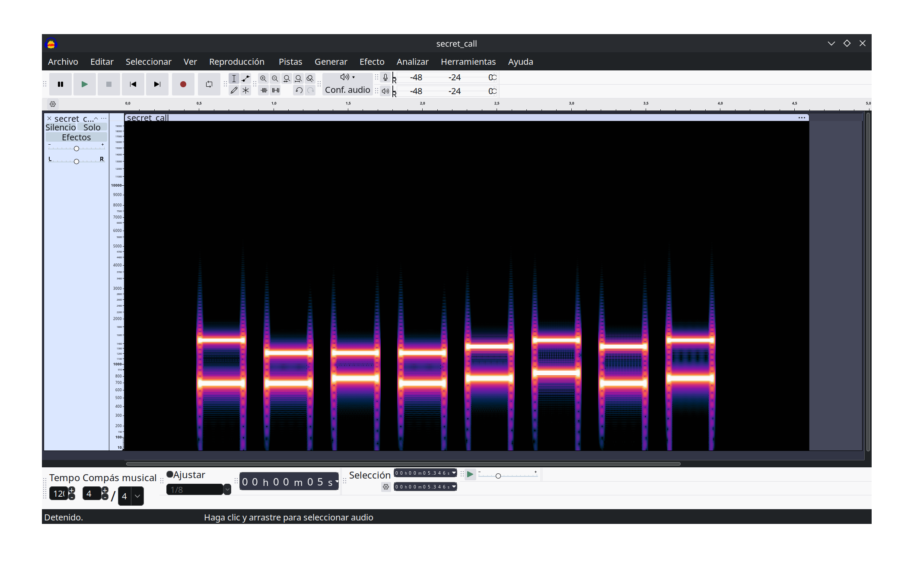

Has interceptado una llamada telefónica de un agente enemigo. La grabación contiene una serie de tonos extraños que parecen ser importantes.

Flag: ikerlan\{código\}

<audio controls>
  <source src={require('./assets/secret_call.wav').default} type="audio/wav" />
  Your browser does not support the audio element.
</audio>

[Descargar archivo de audio](./assets/secret_call.wav)

## Análisis inicial

Al escuchar la grabación, se pueden identificar varios tonos DTMF (Dual-Tone Multi-Frequency) que corresponden a los números del teclado telefónico. Estos tonos son utilizados comúnmente para marcar números en teléfonos.

Podríamos visualizar el espectro de la grabación para identificar los tonos DTMF presentes. Herramientas como Audacity o software de análisis de audio pueden ser útiles para este propósito.



## Decodificación de tonos DTMF

Cada tono DTMF está compuesto por dos frecuencias: una frecuencia baja y una frecuencia alta. La tabla siguiente muestra las frecuencias asociadas a cada número del teclado telefónico:

|  | 120 Hz | 1336 Hz | 1477 Hz | 1633 Hz |
|---|---|---|---|---|
| 697 Hz | 1 | 2 | 3 | A |
| 770 Hz | 4 | 5 | 6 | B |
| 852 Hz | 7 | 8 | 9 | C |
| 941 Hz | * | 0 | # | D |

Podemos usar una herramienta online como [DTMF Decoder](https://dtmf.netlify.app/) para subir el archivo de audio y obtener la secuencia de números correspondiente a los tonos DTMF.


```none title="Secuencia DTMF decodificada"
31415926
```

Sabiendo que el formato de la flag es ikerlan\{código\}, podemos deducir que la flag resultante es:

```
ikerlan{31415926}
```