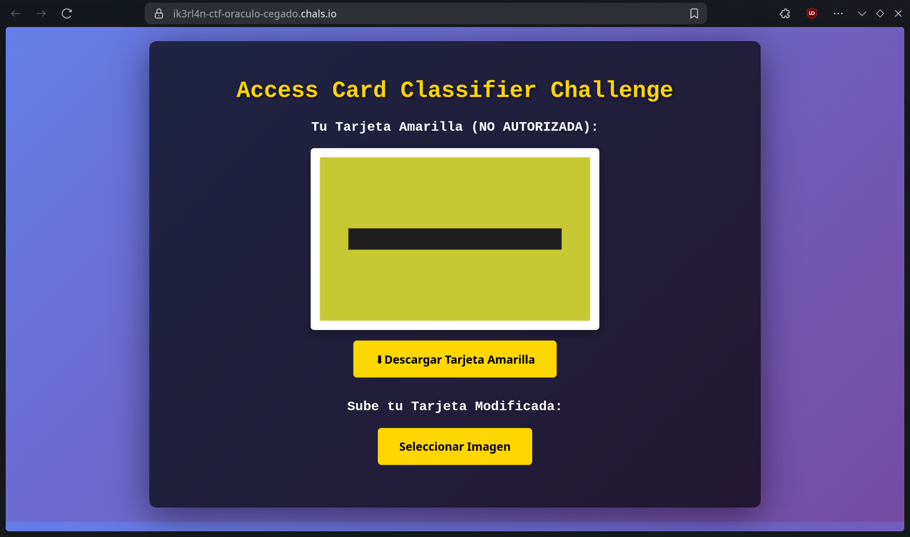
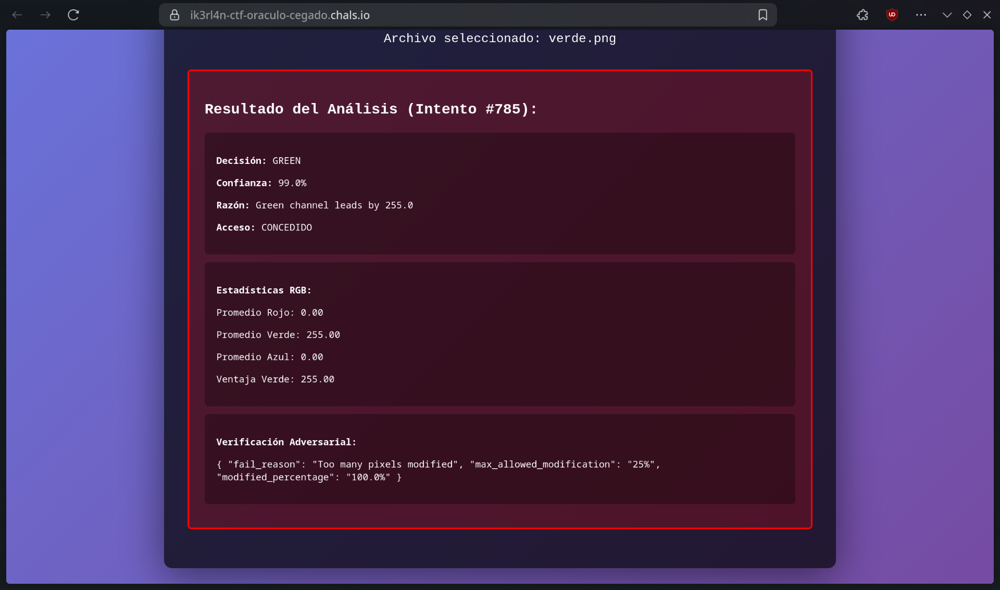
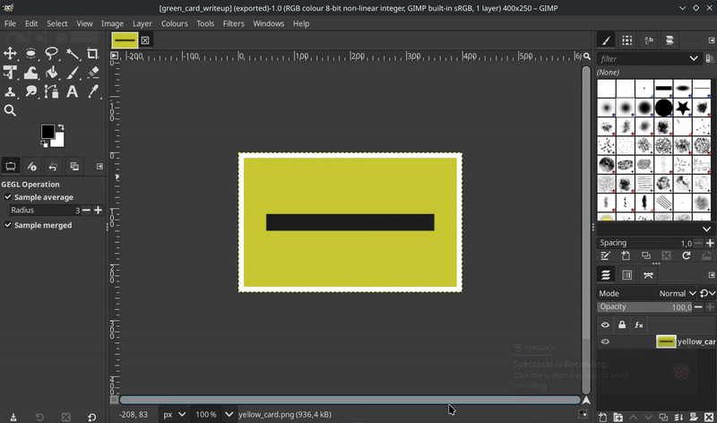

El sistema de seguridad de MegaCorp usa un clasificador de imágenes para controlar el acceso. Solo permite entrar si detectas que llevas una "tarjeta de acceso verde". Tienes una imagen de una tarjeta Amarilla (acceso denegado), pero has descubierto que el clasificador tiene una vulnerabilidad.

¿Podrás engañar al clasificador?


[Descargar Tarjeta Amarilla](./assets/yellow_card.png)

## Análisis inicial

Parece que tenemos que usar una tarjeta de acceso de color verde para que nos den acceso a la página. Vamos a ver que pasa si subo una imagen completamente verde que he encontrado por ahí.


Obtenemos el siguiente resultado del clasificador:



Lo pongo en texto para que se vea mejor:

```
Decisión: GREEN

Confianza: 99.0%

Razón: Green channel leads by 255.0

Acceso: CONCEDIDO
```

```
Estadísticas RGB:

Promedio Rojo: 0.00

Promedio Verde: 255.00

Promedio Azul: 0.00

Ventaja Verde: 255.00
```

```
Verificación Adversarial:

{ "fail_reason": "Too many pixels modified", "max_allowed_modification": "25%", "modified_percentage": "100.0%" }
```

Se ve que el clasificador se basa en el canal verde de la imagen, y si este es el más alto, nos concede acceso. Además, parece que tiene una verificación adversarial que impide que modifiquemos más del 25% de los píxeles de la imagen.

## Ataque

Lo más sensato sería hacer algún script que modifique la imagen amarilla para que el canal verde sea el más alto, pero sin modificar más del 25% de los píxeles. En mi caso, estaba en juego conseguir una first blood, así que opté por un enfoque más manual.

:::tip
Un enfoque más automatizado podría implicar iterar sobre los píxeles de la imagen amarilla y aumentar selectivamente el valor del canal verde en un subconjunto de píxeles hasta que el promedio del canal verde supere al del canal rojo, asegurándose de no modificar más del 25% de los píxeles.
:::

Abrí la imagen amarilla en un editor de imágenes (GIMP en mi caso) y desde Colours -> Hue-Saturation, cambié el color a ojo hasta que me pareció que la tarjeta era más verde que amarilla, aunque seguía teniendo un tono amarillento.



Tuve la suerte de que el cambio de color no modificaba más del 25% de los píxeles, y al subir la imagen modificada al clasificador, obtuve el siguiente resultado:


En texto:

```
Decisión: GREEN

Confianza: 97.6%

Razón: Green channel leads by 18.8

Acceso: CONCEDIDO
```

```
Estadísticas RGB:

Promedio Rojo: 172.81

Promedio Verde: 191.63

Promedio Azul: 74.03

Ventaja Verde: 18.82
```

```
Verificación Adversarial:

{ "avg_red": "172.8", "max_allowed_modification": "25%", "min_red_required": "160", "modified_percentage": "21.6%", "success": "All constraints satisfied!" }
```

```
ADVERSARIAL ATTACK SUCCESSFUL!
FLAG: ikerlan{4dv3rs4r14l_y3ll0w_t0_gr33n}
```

¡Y con esto conseguimos la flag del reto!

```
ikerlan{4dv3rs4r14l_y3ll0w_t0_gr33n}
```